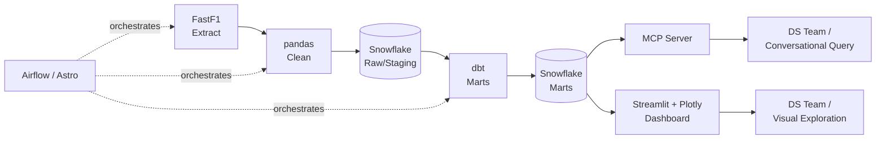

# F1 Telemetry Data Engineering Pipeline

A Snowflake-backed data pipeline for Formula 1 session, lap, and telemetry data —
built to give the [club data science group]'s F1 Telemetry & Race Analytics project
a clean, tested, queryable warehouse instead of everyone hitting the FastF1 API
independently.

This repo owns extraction, cleaning, warehousing, and two consumption surfaces
(an MCP server and a dashboard). It does not own the modeling work — tire
degradation curves, pit-window optimization, and comparative speed profiles
live in the data science group's own notebooks, reading from the marts this
pipeline produces.

## Architecture



| Layer | Tool | Why |
|---|---|---|
| Extract | FastF1 | Standard Python library for F1 session/lap/telemetry data |
| Clean | pandas | Data volume doesn't justify a Spark cluster; pandas is sufficient for typing, missing-lap handling, outlier flags |
| Warehouse | Snowflake | Free-tier trial credits, and a chance to use an existing certification in a real project |
| Transform | dbt | In-warehouse SQL modeling, staging → marts, with built-in tests |
| Orchestration | Airflow (via [Astro CLI](https://www.astronomer.io/docs/astro/cli/overview)) | Schedules extract → load → dbt per race weekend; Astro CLI gives a much lighter local dev loop than configuring Airflow by hand, same underlying Airflow skill |
| Conversational access | MCP server | Exposes schema and safe read-only query tools so the model (or a teammate) can ask questions of the warehouse directly |
| Visual access | Streamlit + Plotly | Session/driver selectors, lap-time charts, lap-by-lap tables — an exploration and QA layer for the DS team before they start modeling |

No cloud provider is required to run this locally — Postgres/Snowflake, Airflow,
and Streamlit all run via `docker-compose up`.

## Data flow

1. `ingestion/` pulls a session's laps and telemetry via FastF1, does light
   pandas cleaning, and loads raw tables into Snowflake staging.
2. `dags/` (Astro-managed Airflow) triggers step 1 per race weekend, then
   triggers a `dbt run`.
3. `transform/dbt/` builds staging → marts models (`fct_lap_times`,
   `fct_tire_stints`, `fct_pit_windows`, ...) with dbt tests for data quality.
4. `mcp_server/` and `dashboard/` both read only from marts — never from raw
   or staging — so there's a single source of truth for "clean" data.

## Quickstart

```bash
git clone <repo-url>
cd f1-telemetry-pipeline
cp .env.example .env        # fill in Snowflake credentials
docker-compose up
```

Then:
- Trigger the DAG: `astro dev start` (from `dags/`)
- Run dbt: `dbt run` (from `transform/dbt/`)
- Launch the dashboard: `streamlit run dashboard/app.py`
- Start the MCP server: see `mcp_server/README.md`

## Data model

| Table | Description |
|---|---|
| `stg_laps` | Raw laps, one row per driver per lap |
| `stg_telemetry` | Raw telemetry samples (speed, throttle, brake) |
| `fct_lap_times` | Cleaned lap times, outlier-flagged |
| `fct_tire_stints` | Stint boundaries with computed degradation slope |
| `fct_pit_windows` | Candidate pit windows per driver per race |

(Fill in exact columns once the dbt models are written.)

## For the data science group

- **Exploring data before modeling**: use the dashboard to sanity-check lap
  times, spot outliers, and understand stint boundaries.
- **Querying conversationally**: ask the MCP server things like "what's
  Verstappen's tire degradation slope at Silverstone" instead of writing SQL.
- **Building models**: read directly from the `fct_*` marts in Snowflake —
  they're tested and documented, so you don't need to re-derive cleaning
  logic per notebook.

Using this pipeline is optional for the DS group — model however you like.
The marts exist so nobody has to re-solve "clean, comparable lap data" from
scratch.

## v2 / potential enhancements

- Streaming ingestion (Kafka/Redpanda) — replay sessions lap-by-lap instead
  of batch-pulling full sessions after they end
- Kubernetes deployment for the Airflow/Spark-if-reintroduced stack
  (currently Docker Compose only)
- CI/CD: GitHub Actions running dbt tests + DAG validation on PR
- Expanded data quality monitoring (dbt tests today; consider Great
  Expectations if coverage needs grow)
- Databricks as an alternate compute target if data volume ever outgrows
  pandas/dbt
- Public-facing deploy of the dashboard (Streamlit Community Cloud) for
  non-technical club members

## Contributing

See [CONTRIBUTING.md](CONTRIBUTING.md).

## License

MIT — see [LICENSE](LICENSE).
