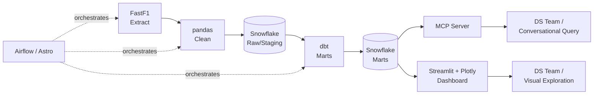

# F1 Telemetry Data Engineering Pipeline

A Snowflake-backed data pipeline for Formula 1 session, lap, and telemetry data —
built to give the [club data science group]'s F1 Telemetry & Race Analytics project
a clean, tested, queryable warehouse instead of everyone hitting the FastF1 API
independently.

This repo owns extraction, cleaning, warehousing, and two consumption surfaces
(an MCP server and a dashboard). It does not own the modeling work — tire
degradation curves, pit-window optimization, and comparative speed profiles
live in the data science group's own notebooks, reading from the marts this
pipeline produces.

## Architecture



| Layer | Tool | Why |
|---|---|---|
| Extract | FastF1 | Standard Python library for F1 session/lap/telemetry data |
| Clean | pandas | Data volume doesn't justify a Spark cluster; pandas is sufficient for typing, missing-lap handling, outlier flags |
| Warehouse | Snowflake | Free-tier trial credits, and a chance to use an existing certification in a real project |
| Transform | dbt | In-warehouse SQL modeling, staging → marts, with built-in tests |
| Orchestration | Airflow (via [Astro CLI](https://www.astronomer.io/docs/astro/cli/overview)) | Schedules extract → load → dbt per race weekend; Astro CLI gives a much lighter local dev loop than configuring Airflow by hand, same underlying Airflow skill |
| Conversational access | MCP server | Exposes schema and safe read-only query tools so the model (or a teammate) can ask questions of the warehouse directly |
| Visual access | Streamlit + Plotly | Session/driver selectors, lap-time charts, lap-by-lap tables — an exploration and QA layer for the DS team before they start modeling |

No cloud provider is required to run this locally — Postgres/Snowflake, Airflow,
and Streamlit all run via `docker-compose up`.

### Why not Spark (and when we would add it)

A season of F1 lap/telemetry data is a few GB at most — well within what
pandas and dbt-on-Snowflake handle comfortably on a single machine. Spark
exists to parallelize compute across a cluster for data that doesn't fit
that model; introducing it here would add operational overhead (cluster
config, job submission, a second execution engine to monitor) without a
performance problem to justify it.

We would reintroduce Spark if any of the following became true:
- Ingesting full-season telemetry at the highest sample rate across
  multiple seasons, pushing data volume into tens of GB+
- Needing to join telemetry against external high-volume datasets
  (e.g. weather or tracking data at similar granularity)
- Moving from batch (post-session) ingestion to genuinely high-throughput
  streaming, where Spark Structured Streaming would replace a simpler
  consumer

At that point, Spark would most naturally replace the pandas cleaning
step between extraction and Snowflake load — dbt's role downstream
wouldn't change.

## Data flow

1. `ingestion/` pulls a session's laps and telemetry via FastF1, does light
   pandas cleaning, and loads them into `raw.laps` / `raw.telemetry` in
   Snowflake (plain table names — not `stg_`, that prefix belongs to dbt's
   staging models in step 3).
2. `dags/` (Astro-managed Airflow) triggers step 1 per race weekend, then
   triggers a `dbt run`.
3. `transform/dbt/` builds `stg_laps`/`stg_telemetry` staging models from
   the raw tables, then marts on top (`fct_lap_times`, `fct_tire_stints`,
   `fct_pit_windows`, ...) with dbt tests for data quality.
4. `mcp_server/` and `dashboard/` both read only from marts — never from raw
   or staging — so there's a single source of truth for "clean" data.

## Setup

### 1. Python environment

Use a virtual environment rather than a user-site install — it avoids PATH
issues with tool executables (`dbt`, `streamlit`) and keeps this project's
dependencies isolated.

**Windows (PowerShell):**
```powershell
git clone <repo-url>
cd f1-telemetry-pipeline
python -m venv .venv
.venv\Scripts\activate
python -m pip install --upgrade pip
python -m pip install -r requirements.txt
```

**macOS / Linux:**
```bash
git clone <repo-url>
cd f1-telemetry-pipeline
python -m venv .venv
source .venv/bin/activate
python -m pip install --upgrade pip
python -m pip install -r requirements.txt
```

You'll need to re-run the `activate` line every time you open a new terminal
for this project. If a command like `dbt --version` or `streamlit --version`
isn't found after activating, check that `.venv` actually activated (your
prompt should show `(.venv)`) before troubleshooting anything else.

> **Common mistake**: `pip install dbt` installs an unrelated package
> called `dbt` on PyPI, not dbt Labs' tool. Always install `dbt-core` plus
> the adapter for your warehouse (`dbt-snowflake` here), as in
> `requirements.txt`.

### 2. Snowflake setup (one time)

Run `docs/setup_snowflake.sql` in Snowsight (as `ACCOUNTADMIN`) to create a
dedicated warehouse/database/schema and a scoped `f1_telemetry_transformer`
role for the pipeline, instead of running everything through the broad
`ACCOUNTADMIN` role.

**Authentication**: institutional/SSO logins (no native Snowflake password)
use key-pair authentication instead of a password:

```bash
openssl genrsa 2048 | openssl pkcs8 -topk8 -inform PEM -out rsa_key.p8 -nocrypt
openssl rsa -in rsa_key.p8 -pubout -out rsa_key.pub
```

Register the public key against your user (see the commented `ALTER USER`
line in `docs/setup_snowflake.sql`), then keep `rsa_key.p8` local only --
it's already excluded via `.gitignore` and must never be committed.

### 3. Environment variables

```bash
cp .env.example .env        # fill in account, login name, key path, role
```

### 4. Orchestration (Astro CLI)

Astro CLI manages its own local Airflow environment separately from the
Python venv above — install it once per machine, not per project:
[Astro CLI install docs](https://www.astronomer.io/docs/astro/cli/install-cli).

```bash
cd dags
astro dev init      # first time only
astro dev start
```

### 5. Run the pieces

- Run dbt: `dbt run` (from `transform/dbt/`, venv activated)
- Launch the dashboard: `streamlit run dashboard/app.py` (venv activated)
- Start the MCP server: see `mcp_server/README.md` (venv activated)
- `docker-compose up` — brings up any containerized services defined in
  `docker-compose.yml` (Streamlit, and Postgres if used for local dev;
  Snowflake is cloud-hosted so nothing to containerize there)

## Data model

Two distinct layers — don't let the `stg_` naming cause confusion: raw
landed tables carry plain names, `stg_` is dbt's own staging-model prefix
applied on top of them.

| Table | Layer | Description |
|---|---|---|
| `raw.laps` | Raw (ingestion) | Laps as landed by the ingestion script, one row per driver per lap |
| `raw.telemetry` | Raw (ingestion) | Telemetry samples as landed (speed, throttle, brake) |
| `stg_laps` | dbt staging | `raw.laps` cleaned/typed by dbt |
| `stg_telemetry` | dbt staging | `raw.telemetry` cleaned/typed by dbt |
| `fct_lap_times` | dbt marts | Cleaned lap times, outlier-flagged |
| `fct_tire_stints` | dbt marts | Stint boundaries with computed degradation slope |
| `fct_pit_windows` | dbt marts | Candidate pit windows per driver per race |

`SNOWFLAKE_SCHEMA` in `.env` (`raw`) is where the **ingestion script** lands
data. dbt's own target schema for its staging/mart models is configured
separately in `transform/dbt/profiles.yml` (commonly `staging`/`marts` via
custom schema config) — the two are not the same setting, even though both
ultimately live in the `f1_telemetry` database.

## For the data science group

- **Exploring data before modeling**: use the dashboard to sanity-check lap
  times, spot outliers, and understand stint boundaries.
- **Querying conversationally**: ask the MCP server things like "what's
  Verstappen's tire degradation slope at Silverstone" instead of writing SQL.
- **Building models**: read directly from the `fct_*` marts in Snowflake —
  they're tested and documented, so you don't need to re-derive cleaning
  logic per notebook.

Using this pipeline is optional for the DS group — model however you like.
The marts exist so nobody has to re-solve "clean, comparable lap data" from
scratch.

## v2 / potential enhancements

- Streaming ingestion (Kafka/Redpanda) — replay sessions lap-by-lap instead
  of batch-pulling full sessions after they end
- Kubernetes deployment for the Airflow/Spark-if-reintroduced stack
  (currently Docker Compose only)
- CI/CD: GitHub Actions running dbt tests + DAG validation on PR
- Expanded data quality monitoring (dbt tests today; consider Great
  Expectations if coverage needs grow)
- Spark (via Databricks or local cluster) reintroduced at the cleaning
  stage if data volume or streaming needs outgrow pandas — see
  "Why not Spark" above for the specific triggers
- Public-facing deploy of the dashboard (Streamlit Community Cloud) for
  non-technical club members

## Contributing

See [CONTRIBUTING.md](CONTRIBUTING.md).

## License

MIT — see [LICENSE](LICENSE).